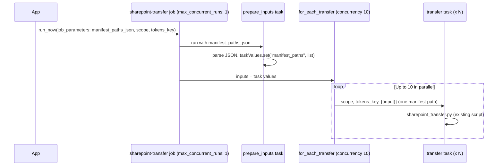

# For Each task + job concurrency refactor

## Current behavior

- **Job** [databricks.yml](databricks.yml): `sharepoint-transfer` has `max_concurrent_runs: 10` and a single task `transfer` that runs [notebooks/sharepoint_transfer.py](notebooks/sharepoint_transfer.py) with `(scope, tokens_key, manifest_path)` and processes all entries in that manifest sequentially.
- **Backend**: For bulk transfers, [transfer_service.py](back-end/services/transfer_service.py) chunks files into manifests (one per `FILES_PER_MANIFEST_CHUNK`), writes each manifest to the volume, and calls [job_service.submit_transfer_via_manifest](back-end/services/job_service.py) **once per chunk** → multiple job runs, each with `python_params=[scope, tokens_key, manifest_path]`.

Multiple concurrent job runs all hit Microsoft Graph, which can overload the API.

## Target behavior

- **One job run** per user transfer request.
- **Job concurrency = 1**: only one run of this job at a time (no parallel runs overloading Graph).
- **For Each concurrency = 10**: within that single run, process up to 10 manifest paths in parallel via a For Each task.
- Backend submits one `run_now` with **job parameters** containing a JSON array of all manifest paths plus `scope` and `tokens_key`.

## Architecture (high level)

## Implementation steps

### 1. Job definition in [databricks.yml](databricks.yml)

- Set `**max_concurrent_runs: 1**` (replace current `10`).
- Add **job `parameters`** (no defaults, provided at run time):
  - `manifest_paths_json` (string)
  - `scope` (string)
  - `tokens_key` (string)
- Replace the single `transfer` task with:
  - **Task `prepare_inputs`**: `spark_python_task` running a new script that receives the manifest paths JSON, parses it, and sets task values for the For Each (see step 2). Parameters: `["{{job.parameters.manifest_paths_json}}"]`.
  - **Task `for_each_transfer`**: `depends_on: [prepare_inputs]`, `for_each_task`:
    - `**inputs**`: `"{{tasks.prepare_inputs.values.manifest_paths}}"`
    - `**concurrency**`: `10`
    - `**task**`: nested task with `task_key: transfer`, same `spark_python_task` as today (sharepoint_transfer.py) with **parameters**: `["{{job.parameters.scope}}", "{{job.parameters.tokens_key}}", "{{input}}"]`. Use the same `environment_key` and ensure the nested task runs the existing script unchanged (it still receives `scope`, `tokens_key`, `manifest_path` per iteration).

Reference: [DAB for_each_task](https://docs.databricks.com/en/dev-tools/bundles/job-task-types.html) (inputs, concurrency, task); [For each task docs](https://docs.databricks.com/en/jobs/for-each.html) (concurrency value).

### 2. New prepare script: `notebooks/prepare_manifest_inputs.py`

- **Purpose**: Turn the job parameter `manifest_paths_json` into a task value list so the For Each task can iterate over it.
- **Arguments**: One — the JSON string of manifest paths (e.g. `'["/Volumes/.../manifest_0.json", ...]'`).
- **Logic**: `import json`; parse `sys.argv[1]` to a list; `dbutils.jobs.taskValues.set(key="manifest_paths", value=parsed_list)`.
- **Deployment**: Same bundle layout as [sharepoint_transfer.py](notebooks/sharepoint_transfer.py) (script under `notebooks/` referenced by relative path in the job). Runs as `spark_python_task` so `dbutils` is available.

### 3. Job service: single run with job parameters

In [back-end/services/job_service.py](back-end/services/job_service.py):

- Add (or replace with) `**submit_transfer_via_manifests`** that:
  - Accepts: `token`, `manifest_paths: List[str]`, optional `task_label`, `ms_refresh_token`, `user_oid`.
  - Writes user tokens once (same as today), then calls `jobs.run_now(job_id=job_id, job_parameters={ "manifest_paths_json": json.dumps(manifest_paths), "scope": scope, "tokens_key": tokens_key })` (no `python_params`).
  - Returns the single `run_id`.
- Keep or reuse the same token-writing and job-id resolution logic.

Databricks parameterized jobs: job-level parameters are overridden via [run_now with job_parameters](https://docs.databricks.com/en/jobs/parameters.html); tasks reference them with `{{job.parameters.*}}`.

### 4. Transfer service: one run per request, map all files to one run_id

In [back-end/services/transfer_service.py](back-end/services/transfer_service.py) (bulk path where job is used):

- Keep the existing loop that chunks `job_items`, builds each manifest, and uploads it to the volume (unchanged).
- **Do not** call `submit_transfer_via_manifest` per chunk. Instead:
  - Collect the list of full manifest paths (e.g. `full_manifest_path` for each chunk).
  - After the loop, call **one** `submit_transfer_via_manifests(ms_token, list_of_manifest_paths, ..., user_oid=user_oid, ms_refresh_token=ms_refresh_token)`.
  - Set `state.run_ids = [run_id]`, `state.run_id_to_file = {str(run_id): [all file names from all chunks]}`, and build `job_run_urls` / `job_run_statuses` for that single run (one URL, one status entry listing all files).

Existing `_sync_state_from_job_runs` and `get_run_statuses` already support a list of run_ids; with one run_id the overall run outcome (SUCCESS/FAILED) will apply to all files in that run. No change required to sync logic; optional future improvement could use task-level results from the For Each to report per-chunk success/failure.

### 5. No change to [notebooks/sharepoint_transfer.py](notebooks/sharepoint_transfer.py)

The script continues to accept `(scope, tokens_key, manifest_path)` and process one manifest per invocation; each For Each iteration passes one manifest path via `{{input}}`.

---

## Scale and limits

**Requirement:** Support up to **~40K files** per transfer. The current approach (pass manifest paths via job param → prepare task → task value → For Each) is sufficient; no alternative pattern is needed.

**Why it fits:**

- **Task value limit** ([docs](https://docs.databricks.com/en/jobs/task-values.html)): The JSON for any `dbutils.jobs.taskValues.set()` value cannot exceed **48 KiB**. Our For Each inputs come from that task value.
- At 40K files and `FILES_PER_MANIFEST_CHUNK` default 200 → **200 manifest paths**. A path is ~80–100 chars; in JSON ~95–105 bytes per path → 200 × ~100 ≈ **20 KiB**, well under 48 KiB.
- **Jobs API** (run_now): Request size limit is 10 MB, so the initial `manifest_paths_json` job parameter is not a concern.

No notebook/script size limits affect this design; only the task value (the list passed into the For Each) is capped at 48 KiB.

---

## Summary of edits

| File                                                                           | Change                                                                                                                                                                         |
| ------------------------------------------------------------------------------ | ------------------------------------------------------------------------------------------------------------------------------------------------------------------------------ |
| [databricks.yml](databricks.yml)                                               | `max_concurrent_runs: 1`; add `parameters`; replace single task with `prepare_inputs` + `for_each_transfer` (inputs from task values, concurrency 10, nested `transfer` task). |
| [notebooks/prepare_manifest_inputs.py](notebooks/prepare_manifest_inputs.py)   | **New**: parse `manifest_paths_json` and set task value `manifest_paths`.                                                                                                      |
| [back-end/services/job_service.py](back-end/services/job_service.py)           | Add `submit_transfer_via_manifests(..., manifest_paths)`, call `run_now` with `job_parameters`; keep or refactor existing submit for reuse.                                    |
| [back-end/services/transfer_service.py](back-end/services/transfer_service.py) | Bulk path: collect manifest paths, call `submit_transfer_via_manifests` once, set single run_id and run_id_to_file for all files.                                              |

## Docs / skills used

- [Databricks Jobs skill](https://docs.databricks.com/en/jobs/index.html) (For Each, task values, parameters).
- [For each task](https://docs.databricks.com/en/jobs/for-each.html): concurrency value, inputs as JSON or task value reference.
- [DAB job task types](https://docs.databricks.com/en/dev-tools/bundles/job-task-types.html): `for_each_task` keys `inputs`, `concurrency`, `task`; job `parameters` for run-time overrides.

